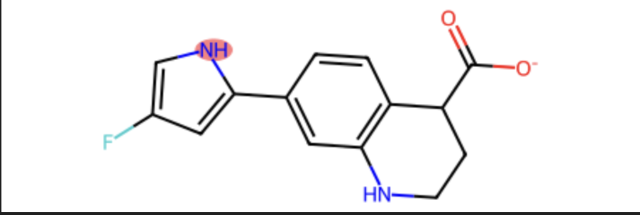

# RDSL: RDKit Domain Specific Language

`rdsl` is a powerful and intuitive domain-specific language (DSL) for selecting atoms and extracting sub-molecules from RDKit molecules. Heavily inspired by PyMOL's selection syntax, `rdsl` brings expressive, natural-language-like queries to the RDKit ecosystem.

## Features

- **Expressive Selection Syntax**: Use logic (`and`, `or`, `not`), topological relationships, and geometric constraints.
- **Sub-molecule Extraction**: Easily extract subsets of molecules with configurable handling of broken bonds (hydrogens, radicals, or wildcards).
- **Hierarchical Functional Groups**: Built-in detection of hundreds of functional groups with smart overshadowing logic (e.g., identifies "toluene" without redundantly tagging the "benzene" core).
- **PDB Support**: Support for PDB-specific selection attributes like `resi`, `resn`, `chain`, and `alt`.
- **Property Queries**: Select atoms based on formal charge, partial charge, mass, valence, and more.

## Installation

```bash
pip install rdsl
```

## Usage

### Atom Selection

The `select_atom_ids` function returns a numpy array of indices for atoms matching the expression.

```python
from rdkit import Chem
from rdsl import select_atom_ids

mol = Chem.MolFromSmiles("Cc1ccccc1O")

# Simple keyword selections
aromatic_atoms = select_atom_ids(mol, "aromatic")

# Complex logical expressions
carbon_rings = select_atom_ids(mol, "elem C and ring")

# Geometric and distance-based queries
near_oxygen = select_atom_ids(mol, "all within 3.0 of elem O")

# Custom SMARTS matching
benzene_matches = select_atom_ids(mol, 'smarts "c1ccccc1"')
```

### Molecule Extraction

The `select_molecule` function extracts the selected atoms into a new Molecule object.

```python
from rdsl import select_molecule

# Extract the benzene ring, automatically capping broken bonds with hydrogens
result = select_molecule(mol, "aromatic")
submol = result.mol

# Track where atoms came from
original_idx = result.atom_mapping[0]

# Handle broken bonds with wildcards (useful for fragments)
result = select_molecule(mol, "aromatic", broken_bonds="wildcards")
```

### Functional Group Detection

Identify functional groups with built-in patterns that respect chemical hierarchies.

```python
from rdsl import get_functional_group_matches

# Returns a pandas DataFrame with identified groups
df = get_functional_group_matches(mol)
print(df[["name", "atom_ids", "group"]])
```

## Syntax Guide

`rdsl` supports a wide range of operators. See [examples.ipynb](examples.ipynb) for a comprehensive list of selection functionality and examples. A non-exhaustive list of operators is shown below:

| Category | Operators / Keywords |
| :--- | :--- |
| **Logic** | `and`, `or`, `not`, `( )` |
| **Flags** | `aromatic`, `aliphatic`, `ring`, `donor`, `acceptor`, `hydrophobic`, `alerts` |
| **Attributes** | `elem`, `atomic_number`, `formal_charge`, `index`, `mass` |
| **PDB** | `resi`, `resn`, `chain`, `name`, `id` |
| **Topology** | `neighbor`, `ringsize`, `bound_to`, `bymolecule`, `byring` |
| **Geometry** | `within <dist> of <expr>`, `beyond <dist> of <expr>`, `around <dist>` |
| **Chemical** | `smarts "<pattern>"`, `functional "<name>"` |
| **Index** | `first`, `last`, `index 0-5+10` |
| **Neighbors** | `neighbor <expr>`, `bound_to <expr>` |


```python
atom_ids = select_atom_ids(mol, "donors and ringsize 5")
mol
```


## Acknowledgements

- **Functional Groups**: The SMARTS patterns used for functional group detection are taken from [SmartChemist](https://github.com/torbengutermuth/SmartChemist) by Torben Gutermuth. NB: Make sure to cite SmartChemist in any publications that use this functionality, and do not modify the SMARTS patterns in a way that violates the license.
- **Selection Parser**: The core DSL parser architecture is a port of the `pyparser` implementation found in [mdtop](https://github.com/SimonBoothroyd/mdtop/blob/main/mdtop/_sel.py), originally inspired by PyMOL.
- **Inspiration**: This project was inspired by Alex Binnie, who developed a similar DSL for OpenEye toolkit.

## License

MIT
